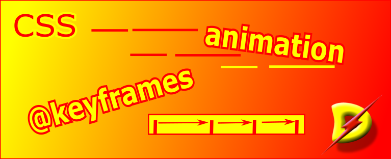

[Home](./readme.md)

# Animation in CSS

Animation in CSS has two parts `@keyframes` and `animation-*` properties

## The `@keyframes` at-rule

The first part of requires us to define the `@keyframes`.  

This lets us specify the CSS-style that should apply at the different points in the duration of the animation.

The different points of time are specified in % values. Any number of offsets positions between 0 and 100 percent can be specified.

`from` can be used for offset `0%`, and `to` is the same as the offset `100%`.

```css
	@keyframes anim-name {
		from { css-style-a }
		to { css-style-b }
	}
```
Below the css style has been specified for three time-points for one property - `background-color`. 

```css
    @keyframes colorit {
        0% { background-color: red; }
        50% { background-color: yellow; }
        100% { background-color: silver; }
    }
```

It may as well specify multiple properties.

```css
    @keyframes colorit {
        0% { 
            background-color: red; 
            left: 0px; 
            top: 50px;
        }
        50% { 
            background-color: yellow; 
            left: 50px; 
            top: 75px;
        }
        100% { 
            background-color: silver; 
            left: 200px;
            top: 25px;
        }
    }
```

## `animation-*` properties

Here is a list of properties that can be used to control how the transition of styles will be rendered.

- `animation-composition`
- `animation-delay`
- `animation-direction`
- `animation-duration`
- `animation-fill-mode`
- `animation-iteration-count`
- `animation-name`
- `animation-play-state`
- `animation-range`
- `animation-range-end`
- `animation-range-start`
- `animation-timeline`
- `animation-timing-function`

Each of this sub-property sets some aspect of the animation.

Below is the definition for @keyframes named `colorit` to be run for 3 seconds.

```css
	div.box {
        ...
        animation-name: colorit;
        animation-duration: 3s;
        ...
 	}
```

All the sub-properties can be specified in a single line using the `animation` shorthand.

```css
animation: 3s colorit;
```
The browser does the math required and renders the appropriate animation. 

Similarly, the animation properties allow the control of delay, timing, number of times (iteration), direction etc. for the designer to achieve his vision.


[Home](./readme.md)
