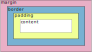

[Home](./readme.md) 

# Size of a Box in CSS

The layout of elements is done by marking the position and dimension of each element as rectangular boxes in the document, based on the CSS Box Model. 

The size of each rectangular box and the space required on the document is a significant consideration in any UI design.

### `box-sizing: content-box`

Consider the following CSS rule...
```css
	.box {
		box-sizing: content-box;
		width: 150px;
		height: 100px;
		margin: 10px;
		padding: 5px;
		border: 2px solid red;
	}
```

Size of the _content-area_ for `.box` will be...

| property | value |
|-|-|
| width | `150px` |
| height | `100px` |

and, the space required it on the document will be...

| property | computation | value |
|-|-|-|
| width | `10 + 2 + 5 + 150 + 5 + 2 + 10` | 184px |
| height | `10 + 2 + 5 + 100 + 5 + 2 + 10` | 134px |

> To computate of space for margins, one must take into consideration the impact of `margin-collapse`.

### `box-sizing: border-box`

Now, check this rule...

```css
	.box {
		box-sizing: border-box;
		width: 150px;
		height: 100px;
		margin: 10px;
		padding: 5px;
		border: 2px solid red;
	}
```
In this case, the size of the _content-area_ for `.box` will be...

| property | computation | value |
|-|-|-|
| width | `150 - 5 - 2 - 5 - 2` | `136px` |
| height | `100 - 5 - 2 - 5 - 2` | `86px` |

and, the space required by the element on the document will be...

| property | computation | value |
|-|-|-|
| width | `10 + 150 + 10` | `170px` |
| height | `10 + 100 + 10` | `120px` |

## How does this work?

An understanding of the Box Model goes a long way in achieving the desired UI/UX.

### Areas and Boxes

The rectangular box for every element has 4 areas or parts...



#### content-area

This is the area where the actual content - text, images or other HTML elements - are displayed. 
	
#### padding-area

specified using `padding` or the `padding-*` sub-properties.

This is the area that surrounds the content-area and extends to the outer edge of the padding on each side.

#### border-area

specified using `border` or the `border-*` sub-properties.

This is the area surrounding the padding-area and extending up to the outer edge of the border on each side.

#### margin-area

specified as `margin` or using the `margin-*` sub-properties.

The area surrounding the border-area and extending up to the edge of the margin specified on each side.

## The Box

Based on these areas and their different combinations, the browser uses different boxes when it computes the layout for a each element in the document... 

- **content-box** - it is the innermost box (or the content-area) of the element that renders the actual content - text, images and other elements.

- **padding-box** - from the outer edge of the content box and up to the outer edge of the padding-area. If padding width and height is 0, then padding-box will be same as content-box. 

- **border-box** - starts from the outer area of the padding-box up to the outer edge of the border-area. 

- **margin-box** - the area of the element beyond the border-box and up to the outer edge of the margin-area.

- **visual-box** - the box that is seen on the web page, this includes the content, padding and border. The margin is not a part of this. 

- **layout-box** - the space occupied by the element on the document - including its content, padding, border and margin. This space is used for layout and position on the document.

- **paint-box** - this is the paintable area of the element. This area is the excludes the _margin-area_.

- **coord-box** - this is the location and size of the element within its parent. These coordinates exclude the margin area (of the parent).

## Sub-Properties

Using sub-properties, different values can be set for the top, left, bottom and right sides of padding, border and margin.

- `padding`
	- `padding-left`
	- `padding-right`
	- `padding-top`
	- `padding-bottom`
	- `padding-block`
	- `padding-block-start`
	- `padding-block-end`
	- `padding-inline`
	- `padding-inline-start`
	- `padding-inline-end`

- `border`
	- `border-left-width`
	- `border-right-width`
	- `border-top-width`
	- `border-bottom-width`
	- `border-block-width`
	- `border-block-start-width`
	- `border-block-end-width`
	- `border-inline-width`
	- `border-inline-start-width`
	- `border-inline-end-width`

border property has sub-properties for setting styles and color of each side.

- `margin`
	- `margin-left`
	- `margin-right`
	- `margin-top`
	- `margin-bottom`
	- `margin-block`
	- `margin-block-start`
	- `margin-block-end`
	- `margin-inline`
	- `margin-inline-start`
	- `margin-inline-end`

## `box-sizing`

CSS allows for two box-sizing options.

### `content-box`

```css
	.box {
		box-sizing: content-box;
		...
	}
```


In a `content-box`, the `width`, `min-width`, `max-width`, `height`, `min-height`, `max-height` properties specified denote the dimension of the content-area. The padding, border etc add on to this to compute the `<layout-box>`.

### `border-box`

```css
	.box {
		box-sizing: border-box;
		...
	}
```


In a `border-box`, the `width`, `min-width`, `max-width`, `height`, `min-height`, `max-height` properties specified set the dimensions of the `<paint-box>`, i.e. the content, padding and border areas are include within the `width` and `height`.

[Home](./readme.md) 
