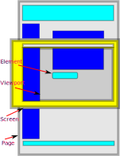

# Coordinate System in CSS

Cordinates are used to indicate the location of a pixel in a graphics context. 

## Dimensions and Origin

### x-cordinate

indicates the location on the horizontal axis

### y-cordinate

indicates the location on the vertical axis

### z-cordinate

indicates the position along views - to - screen axis. 

z-axis cordinates are handled differently for showing a graphic shape in 3d or for rendering layers of elements one on top of the other in the 2d mode.

`z-index` property is used to decide which element will be shown above or below other overlapping elements. The element with the lowest z-index is recognized as the topmost layer and will be shown above all others.

### Origin

The position of each point is defined relative to a fixed point in the context. This fixed point is called **Origin**.

In a browser, the default point of origin is the top-left corner of the context. The point below this origin is moves in the positive y direction and to the left of the origin moves in the positive x direction.

## Graphic Contexts

CSSOM maintains cordinates on 4 graphics contexts...

When a browser renders a page, the cordinates of each pixel is maintains in 4 contexts.

### Offset for Elements

The position of the pixel within the element is called its **`Offset`**. ie. if it is the point along the x and y axes when we consider the top-left point of the element as the origin.

### Client for Viewport

The part of the browser dedicated to displaying the webpage being being rendered is known as the **`Viewport`**. The location of a pixel with reference to the viewport is called its position on the `Client`. 

The viewport is generally a part of the screen and displays a part of the webpage. If the page is bigger than the viewport, scrollbars are used to control which part of the page is visible in the viewport.

### Page

Page is the entire rendered document. Any cordinate on the page cordinate system will always be same...

- no matter how much it has been scrolled. 
- no matter where it is visible to the user or not.

By default, `Page` cordinates give the position where the top-left corner of the page is considered the origin.

### Screen

Screen is the entire physical device where the document is presented. A single point on the Screen will correspond to the different points on the Viewport if the Viewport is moved.

## Cordinates in Event Handling

### MouseClick Event

* `MouseClick.OffsetX` and `MouseClick.OffsetY`
* `MouseClick.ClientX` and `MouseClick.ClientY`
* `MouseClick.PageX` and `MouseClick.PageY`
* `MouseClick.ScreenX` and `MouseClick.ScreenY`

These cordinates are generally used in Javascript to find-out where the user clicked the mouse while browsing and respond accordingly.

### Touch Event

* `Touch.ClientX` and `Touch.ClientY`
* `Touch.PageX` and `Touch.PageY`
* `Touch.ScreenX` and `Touch.ScreenY`

These cordinates are generally used in Javascript to find-out where the user touched on the screen.

## Transform the cordinates

CSS provides properties that allow you to alter the cordinates of certain elements. 

The cordinates of certain elements can be transformed. The transform operations supported are...

* `transform-origin`
* `rotate`
* `scale`
* `translate`
* `skew`
* `perspective`

Some of the transformations work in 3d mode also.
