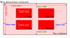

[Home](./readme.md) 

# FlexBox Layout in CSS

[](https://www.dataspec.info/)

The **FlexBox layout** is initiated with the `display: flex;` property and you can control how the children of the element are laid-out inside the parent on the webpage.

The flexbox layout plays probably plays a very important role in planning a responsive web layout.

```css
(CSS)
.parent {
	display: flex;
	... other properties
}
```

For the display property, the flex value can be alongwith inline (`display: inline flex` or `display: inline-flex`) to define inline flex containers and with block (`display: block flex` or `display: block-flex`) to define block flex containers. `flex` used by itself defines a block level containter

```html
(HTML)
<div class='parent'>
	<div class='child1'>
		...content of child 1
	</div>
	<div class='child2'>
		...content of child 2
	</div>
	....
</div>
```

Each item inside a flexbox is called *flex item* and the flexbox itself is referred to as the *flex container*. 

The layout of flex items can be in either horizontal or vertical direction.

## Main Axis and Cross Axis

The direction in the items are laid out is known as the *main axis* and the direction perpendicular to the main axis is known as the *cross axis*. 

By default, `row` is the main axis, this can be changed by specifying the desired `flex-direction`.

The size of a flex item along the main axis is identified as the *main size*, where as its size along the cross axis is the  *cross size*

## Properties for the flexbox

Flexbox has some properties applicable at the parent and child levels that can be used to create innovative layouts. 

| Parent Level Properties | Child Level Properties |
|--|--|
| [`flex-direction`](#flexdirection) | [`flex-grow`](#flexgrow) |
| [`flex-wrap`](#flexwrap) | [`flex-shrink`](#flexshrink) |
| [`justify-content`](#justifycontent) | [`flex-basis`](#flexbasis) |
| [`justify-items`](#justifyitems) | [`justify-self`](#justifyself) |
| [`align-content`](#aligncontent) | [`align-self`](#alignself) |
| [`align-items`](#alignitems) | [`order`](#order) |
| [`column-gap`](#columngap) | |
| [`row-gap`](#rowgap) | |
| **Shorthands** |
| [`flex-flow`](#flexFlow) | [`flex`](#flex) |
| [`place-content`](#placecontent) | [`place-self`](#placeself) |
| [`place-items`](#placeitems) | |
| [`gap`](#gap) | |


### At parent (or container) level...

Here are the properties that must be specified for the container element to control the flow of flex items in it.

* `flex-direction` <a id='flexdirection'></a>

	determines the direction in which the successive items is to placed in the flex container.

	When the direction is `row` or `row-reverse` the main axis is in the horizontal direction.

	

	Similarly, when the direction is `column` or `column-reverse` the main axis is in the vertical direction.

	

	> **Note**
	> ---
	> When flex-direction: row, then default `width` of container is `100%`, and 
	>
	> When flex-direction: column, the default `height` is the height required to render the content.


* `flex-wrap` <a id='flexwrap'></a>

	determines whether are items will be laid out on one line or may flow onto multiple lines.

* `flex-flow` <a id='flexflow'></a>

	This is the shorthand property for...
	* [`flex-direction`](#flexdirection)
	* [`flex-wrap`](#flexwrap)

* `justify-content` <a id='justifycontent'></a>

	justifies the overall content along the **main axis**.

* `justify-items` <a id='justifyitems'></a>

	sets the justification of the individual elements along the main axis within the dimensions designated to it after `justify-content` is processed.

	This setting applies to each of the elements in the flexbox, unless a [`justify-self`](#justifyself) is specified to an element at the child level.

* `align-content` <a id='aligncontent'></a>

	Aligns the overall content along the **cross axis**.

* `align-items` <a id='alignitems'></a>

	Aligns the indiviual elements along the cross axis within the dimensions designated to it after `align-content` is processed.

	This alignment is applied to each of element in the flexbox, unless a [`align-self`](#alignself) is specified at the child level.

* `place-content`<a id='placecontent'></a>

	This is a shorthand property for 
	* [`align-content`](#aligncontent), and 
	* [`justify-content`](#justifycontent).

	If one value is provided, that value applied to both `align-content` and `justify-content`. 

	If two values are provided, the first will be for `align-content` and the second will be for `justify-content`.

* `place-items` <a id='placeitems'></a>

	This is a shorthand property for 
	* [`align-items`](#alignitems) and
	* [`justify-items`](#justifyitems).

	If one value is provided, that value applied to both `align-items` and `justify-items`. 
	
	If two values are provided, the first will be for `align-items` and the second will be for `justify-items`.

* `column-gap`<a id='columngap'></a>

	Determines the gap between columns in the `flex` box. Also works for `grid` and `multi-column` container.

* `row-gap`<a id='rowgap'></a>

	Determines the gap between rows in the `flex` and `grid` containers

* `gap`<a id='gap'></a>

	This is the shorthand property for...
	* [`column-gap`](#columngap)
	* [`row-gap`](#rowgap)

### At child level...

Below are the properties that may be specified to control the rendering of the flex items.

* `flex`<a id='flex'></a>

	This is shorthand property for...
	* [`flex-grow`](#flexgrow)
	* [`flex-shrink`](#flexshrink)
	* [`flex-basis`](#flexshrink)
	
* `flex-grow` <a id='flexgrow'></a>

	This determines how the *positive free space* in the flex container is assigned to the *main-size* of the item i.e. it specifies the grow factor for an item.

* `flex-shrink` <a id='flexshrink'></a>

	This determines how the *negative free space* in the flex container is assigned to the *main-size* of the item i.e. it specifies the shrink factor for an item.

* `flex-basis` <a id='flexbasis'></a>

	This specifies the initial main size for the flex item. The final computed main size will depend when the `flex-grow` and `flex-shrink` values are applied to this.

* `justify-self`<a id='justifyself'></a>

	This property overrides the [`justify-items`](#justifyitems) property defined for the flex container.

* `align-self`<a id='alignself'></a>

	This property overrides the [`align-items`](#alignitems) property defined for the flex container.

* `place-self`<a id='placeself'></a>

	This property overrides the [`place-items`](#placeitems) property values provided for the flex container.

* `order` <a id='order'></a>

	The `order` property defines the sequence in which each flex item is rendered.


[Home](./readme.md) 
