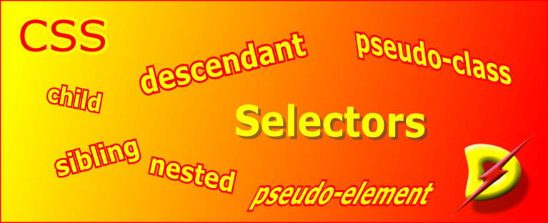

[Home](./readme.md) 

# Selectors in CSS

## Introduction

Selector is the first part of any CSS rule. The selector identifies to which part or section of the HTML document the rule will be applied.

```css
    selector {
        property: value;
        ....
    }
```

## Simple Selectors

Select elements based on name, id, class

### `name` of element

The name of the element is directly used as the selector.

eg
```css
    body {
        ...
    }
    div {
        ...
    }
    input {
        ...
    }
```

### `id` of element

In HTML, some elements can be identified with the `id` attribute.

```html
    <p id='idname'>This is a some text.</p>
```

In CSS, the selector for this will start with a hash (`#`) followed by the name of the id.

eg
```css
    #idname {
        ...
    }
```

### `class` of element

In HTML, when you may define a class attribute.
```html
    <div class='container'>...</div>
```

In CSS, the selector for the class starts with a period (`.`) followed by the name of the class.

```css
    .container {
        ...
    }
```

Multiple class names can be marked in HTML by seperating them with a space.

```html
    <div class='card cardinfo'>
```

When multiple classes are defined, then the styling rules will apply in the order they are listed. The latest value for a property will prevail if the property values are given in more than one class.

## Attribute Selector

Attribute selector matches elements based on the value of some of its attribute.

-   `[attr]`
-   `[attr=value]`
-   `[attr~=value]`
-   `[attr|=value]`
-   `[attr^=value]`
-   `[attr$=value]`
-   `[attr*=value]`
-   `[attr operator value i]`
-   `[attr operator value s]`

`.` and `#` are special operators to identify the attributes id and class. `[]` allow to select any attribute.

| selector | description |
|-|-|
| `a[target]` | any element `a` having a `target` attribute |
| `a[target='_blank']` | any anchor element having target = _blank |
| `div[class\|="card"]` | any div with class having value the whole word `card` or `card` followed by `-`, like `card-head` or `card-body` |
| `div[class^="card"]` | any div with class whose value starts with `card` |
| `div[class$="head"]` | any div with class whose value ends with `head` |
| `div[class*="card"]` | any div with class having value contains the string `card` anywhere |

## Selector List - Comma (`,`) separated

```css
    div, li, .cardinfo {
        ...
    }
```
If the same styling is to be applied to multiple selectors then use comma (`,`) to separate the selectors and then define the css rule.

## Combinators

A combinator is a combination of two or more selectors used together. Combinators are used define the specificity of the selector.

### Descendant Selector (space)

eg
```css
    div p {
        ...
    }
```
This will select all `p`s *under* all `div`s. `p`s in any child of the `div`s will also be included.

### Child Selector (>)

eg
```css
    div > p {
        ...
    }
```
This will select all `p`s *directly under* all `div`s. `p`s nested inside any child of `div` will not be included.

### Adjacent Sibling Selector (+)

eg
```css
    div + p {
        ...
    }
```
This will select `p`s that are *immediately* after `div`s - at the same level. No parent or child will be included.

### General Sibling Selector (~)

eg
```css
    div ~ p {
        ...
    }
```
This will select `p`s that are *anywhere* after `div`s - at the same level. No parent or child will be included.

## Nested Selector (with and without `&`)

### preceding selector with &

```css
    .parent {
        ...
        & :nested {
            ...
        }
    }
```

evaluates to...

```css
    .parent {
        ... parent rules
    }

    .parent:nested {
        ...child rules
    }
```

all `.parent` having puesdo-class `:nested `

### without &

When the selector is nested without `&`, a space is added to the resulting nested css-rule, i.e.

```css
    .parent {
        ... parent rules
        :nested {
            ... child rules
        }
    }
```
evaluates to...

```css
    .parent {
        ... parent rules
    }

    .parent *:nested {
        ...child rules
    }
```

all descendants of `.parent` having puesdo-class `:nested` 

### adding & after the selector

```css
    .outer {
        ... outer rules
        .nested & {
            ...nested rules
        }
    }

```

evaluates to...


```css
    .outer {
        ... outer rules
    }

    .nested .outer {
        ...nested rules
    }
```

Here outer rules will apply normally apply `.outer` selector, but when `.outer` is a descendant of the `.nested` selector then  the nested rules will apply.

### adding multiple & after the selector

```css
    .parent {
        ... parent rules
        .nested & & & {
            ...nested rules
        }
    }

```

the three `&`s evaluate to...


```css
    .parent {
        ... parent rules
    }

    .nested .parent .parent .parent {
        ...child rules
    }
```

## Pseudo-classes

Pseudo-classes are selectors that are recognized in the browser without explicitly being defined in the web-page.

A pseudo-class can used by adding `:` before it.

eg
```css
  a:active          /* active links */
  div:hover         /* when mouse hovers over the <div> */
  div:first-child   /* the first child inside the <div> */
```

### List of Pseudo-classes

* `:active`
* `:any-link`
* `:dir`(ltr|rtl) 
* `:empty`
* `:has`(*selector*)
* `:hover`
* `:is`(*selector*)
* `:lang`(*language*)
* `:link`
* `:not`(*selector*)
* `:root`
* `:state`(*identifier*)
* `:target`
* `:visited`
* `:where`(*selector*)

/* for child */

* `:first-child`
* `:last-child`
* `:nth-child`(*position*)
* `:nth-last-child`(*position*)
* `:only-child`

/* for of-type */

* `:first-of-type`
* `:last-of-type`
* `:nth-of-type`(*position*)
* `:nth-last-of-type`(*position*)
* `:only-of-type`

/* for inputs */

* `:checked`
* `:disabled`
* `:enabled`
* `:focus`
* `:focus-visible`
* `:in-range`
* `:inderminate`
* `:invalid`
* `:optional`
* `:out-of-range`
* `:read-only`
* `:read-write`
* `:required`
* `:valid`

## CSS Pseudo Elements

Pseudo Elements are elements that the browser recognizes even though they are not defined in the web-page.

* `::after`
* `::before`
* `::file-selector-button`
* `::first-letter`
* `::first-line`
* `::grammar-error`
* `::marker`
* `::placeholder`
* `::selection`
* `::spelling-error`
* `::target-text`
* `::backdrop`
* `::cue`
* `::highlight`
* `::part`
* `::slotted`
* `::view-transition`
* `::view-transition-image-pair()`
* `::view-transition-group()`
* `::view-transition-new()`
* `::view-transition-old()`

[Home](./readme.md)
